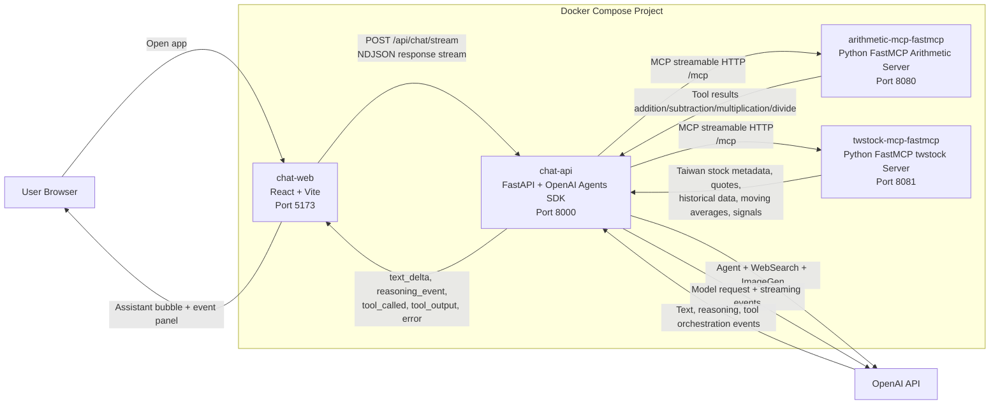
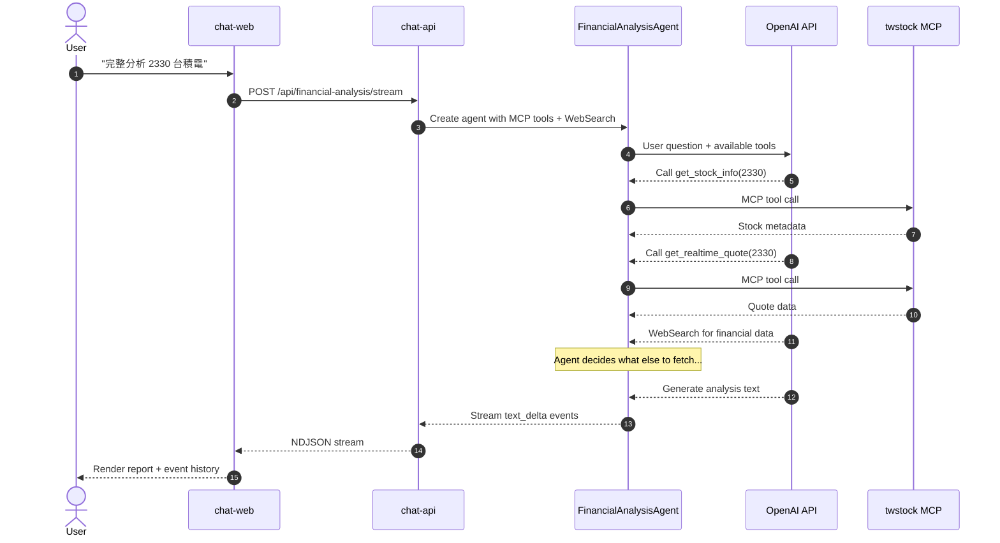
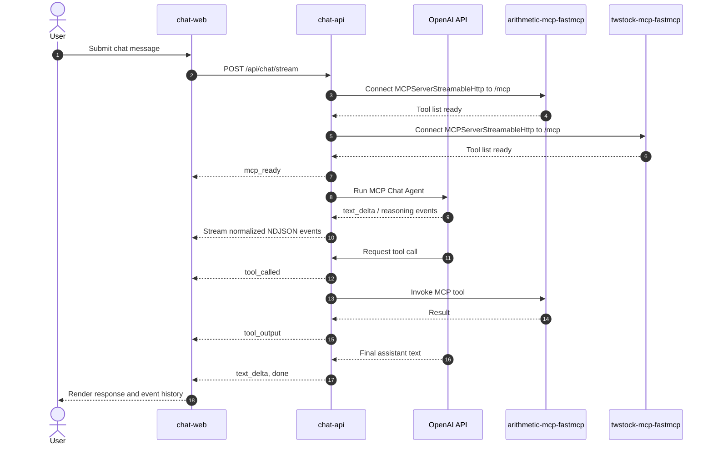

# Current Architecture Design

## Purpose

This project runs a Docker Compose based MCP chatbot with Python FastMCP MCP servers:

- `chat-web`: React/Vite chatbot frontend.
- `chat-api`: FastAPI backend that uses the Python OpenAI Agents SDK.
- `arithmetic-mcp-fastmcp`: Python FastMCP server exposing arithmetic tools over streamable HTTP.
- `twstock-mcp-fastmcp`: Python FastMCP server exposing Taiwan stock tools powered by `twstock`.

The frontend streams assistant text into the chat bubble while showing reasoning and tool events in a right-side event history panel grouped by chat round.

## Key Architecture Decisions

### MCP Servers: Python FastMCP

- Same language family as `chat-api`.
- Faster to extend for future stock-research tools.
- Supports network-based streamable HTTP MCP transport for Docker Compose.
- SSE remains a legacy compatibility option; streamable HTTP is the default.

### Financial Analysis: Agent-Owned Tool Calling

The financial analysis workflow uses the OpenAI Agents SDK's native tool-calling loop. The backend is a thin orchestration layer:

1. Parse the stock code from the user's request.
2. Create a `FinancialAnalysisAgent` with MCP twstock tools + WebSearch.
3. Pass the user's question to the agent via `Runner.run_streamed`.
4. The **agent decides** which MCP tools to call, in what order, and how many times.
5. Stream events (text, reasoning, tool calls, tool outputs) to the frontend.

There is no backend-side data collection, section inference, or prompt templating. The model owns all tool-calling decisions.

For visualization requests (detected by keyword match), a separate `FinancialVisualizationAgent` with `ImageGenerationTool` generates chart images from data already present in the chat context.

## System Diagram



## Financial Analysis Flow



## Chat Flow



## Runtime Services

| Service | Container | Port | Responsibility |
| --- | --- | --- | --- |
| `chat-web` | `arithmetic-mcp-chat-web` | `5173` | Browser UI for chat, streaming assistant text, and round-grouped event history. |
| `chat-api` | `arithmetic-mcp-chat-api` | `8000` | Keeps `OPENAI_API_KEY` server-side, runs agents, streams normalized events to the frontend. |
| `arithmetic-mcp-fastmcp` | `arithmetic-mcp-fastmcp` | `8080` | Python FastMCP server exposing `addition`, `subtraction`, `multiplication`, and `divide`. |
| `twstock-mcp-fastmcp` | `twstock-mcp-fastmcp` | `8081` | Python FastMCP server exposing Taiwan stock tools. |

## Important Endpoints

| Endpoint | Owner | Use |
| --- | --- | --- |
| `GET /` | `chat-web` | Serves the React application. |
| `GET /api/health` | `chat-api` | Backend health check. |
| `GET /api/mcp/tools` | `chat-api` | Lists tools discovered from MCP servers. |
| `POST /api/chat/stream` | `chat-api` | Main chatbot endpoint; returns NDJSON events. |
| `POST /api/financial-analysis/stream` | `chat-api` | Financial analysis endpoint; returns NDJSON events. |
| `/mcp` | MCP servers | FastMCP streamable HTTP transport endpoint. |

## twstock MCP Tools

| Tool | Purpose |
| --- | --- |
| `get_stock_info(stock_id)` | Read stock metadata from `twstock.codes`. |
| `get_realtime_quote(stock_id)` | Fetch realtime quote data for one Taiwan stock. |
| `get_realtime_quotes(stock_ids)` | Fetch realtime quote data for multiple Taiwan stocks. |
| `get_historical_data(stock_id, year, month)` | Fetch historical OHLC trading data. |
| `calculate_moving_average(stock_id, days)` | Calculate a moving average from recent closing prices. |
| `analyze_best_four_point(stock_id)` | Run `twstock.BestFourPoint` buy/sell/neutral technical signal logic. |

## Event Contract

`chat-api` emits one JSON object per line.

- `text_delta`: appended to the assistant message bubble.
- `reasoning_delta`: shown in the event history panel.
- `reasoning_event`: shown in the event history panel.
- `tool_called`: shown in the event history panel.
- `tool_output`: shown in the event history panel.
- `agent_started`: a specialist agent has started.
- `agent_completed`: a specialist agent completed.
- `image_generated`: the visualization agent produced an image.
- `error`: shown in the event history panel.
- `mcp_ready`: ignored by the frontend event panel.
- `done`: ignored by the frontend event panel.

## Configuration

Docker Compose reads `.env` from the project root:

```sh
OPENAI_API_KEY="..."
OPENAI_MODEL="gpt-4.1"              # Text model for agents
OPENAI_IMAGE_MODEL="gpt-image-1.5"  # Image generation model
FINANCIAL_ANALYSIS_MODEL="gpt-5-mini"
FINANCIAL_ANALYSIS_WEB_CONTEXT="medium"
ENABLE_FINANCIAL_IMAGE="true"
```

MCP server URLs (set automatically in Docker Compose):

```sh
MCP_HTTP_URL=http://arithmetic-mcp-fastmcp:8080/mcp
TWSTOCK_MCP_HTTP_URL=http://twstock-mcp-fastmcp:8081/mcp
```

## Backend Code Structure

```
backend/
├── app.py                          # FastAPI routes, MCP server setup, chat agent
├── financial_agents/
│   ├── __init__.py                 # Exports run_financial_analysis, FinancialAnalysisRequest
│   ├── agents.py                   # Agent definitions (FinancialAnalysisAgent, FinancialVisualizationAgent)
│   ├── orchestrator.py             # Thin orchestration: parse request → run agent → stream events
│   └── schemas.py                  # Pydantic models (FinancialAnalysisRequest, SpecialistResult, etc.)
└── tests/
    └── test_financial_agents.py    # Unit tests for schemas, helpers, visualization detection
```

## Start And Verify

```sh
docker compose up --build -d
curl -i http://localhost:5173
curl -i http://localhost:8000/api/health
curl -i http://localhost:8080/healthz
curl -i http://localhost:8081/healthz
```

Open the app: http://localhost:5173
