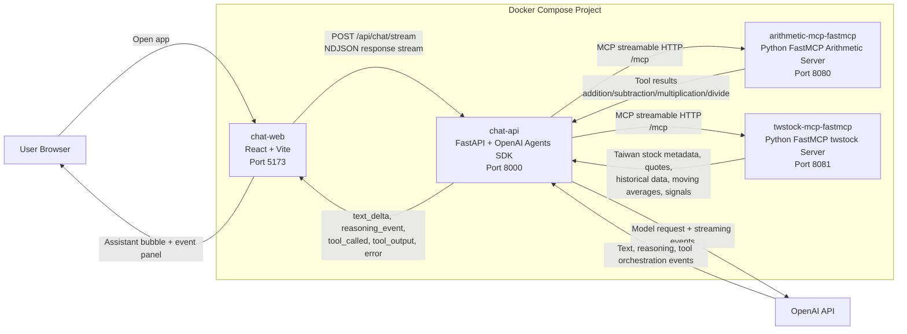
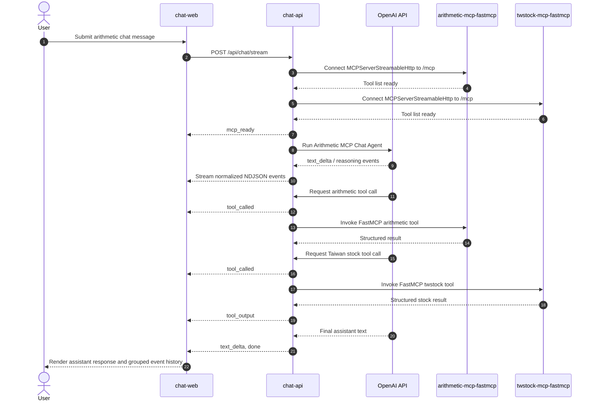

# Current Architecture Design

## Purpose

This project currently runs a Docker Compose based MCP chatbot with Python FastMCP MCP servers:

- `chat-web`: React/Vite chatbot frontend.
- `chat-api`: FastAPI backend that uses the Python OpenAI Agents SDK.
- `arithmetic-mcp-fastmcp`: Python FastMCP server exposing arithmetic tools over streamable HTTP.
- `twstock-mcp-fastmcp`: Python FastMCP server exposing Taiwan stock tools powered by `twstock`.

The frontend streams assistant text into the chat bubble while showing reasoning and tool events in a right-side event history panel grouped by chat round.

## Key Architecture Decision

Use Python FastMCP for MCP servers:

- It keeps MCP tool implementation in the same language family as `chat-api`.
- It is faster to extend for future stock-research tools and data-provider integrations.
- It supports network-based streamable HTTP MCP transport for Docker Compose deployments.
- SSE can remain a legacy compatibility option, but streamable HTTP should be the default for new services.

## System Diagram



## Request And Event Flow



## Runtime Services

| Service | Container | Port | Responsibility |
| --- | --- | --- | --- |
| `chat-web` | `arithmetic-mcp-chat-web` | `5173` | Browser UI for chat, streaming assistant text, and round-grouped event history. |
| `chat-api` | `arithmetic-mcp-chat-api` | `8000` | Keeps `OPENAI_API_KEY` server-side, converts chat rounds into an agent prompt, streams normalized events to the frontend. |
| `arithmetic-mcp-fastmcp` | `arithmetic-mcp-fastmcp` | `8080` | Python FastMCP server exposing `addition`, `subtraction`, `multiplication`, and `divide`. |
| `twstock-mcp-fastmcp` | `twstock-mcp-fastmcp` | `8081` | Python FastMCP server exposing Taiwan stock metadata, realtime quote, historical OHLC, moving average, and Best Four Point tools. |

## Important Endpoints

| Endpoint | Owner | Use |
| --- | --- | --- |
| `GET /` | `chat-web` | Serves the React application. |
| `GET /api/health` | `chat-api` | Backend health check. |
| `GET /api/mcp/tools` | `chat-api` | Lists tools discovered from the MCP server. |
| `POST /api/chat/stream` | `chat-api` | Main chatbot endpoint; returns newline-delimited JSON events. |
| `GET /healthz` | `arithmetic-mcp-fastmcp` | MCP server health check exposed by the container app. |
| `/mcp` | `arithmetic-mcp-fastmcp` | FastMCP streamable HTTP transport endpoint. |
| `GET /healthz` | `twstock-mcp-fastmcp` | Taiwan stock MCP server health check. |
| `/mcp` | `twstock-mcp-fastmcp` | FastMCP streamable HTTP transport endpoint for Taiwan stock tools. |
| `/sse` | `arithmetic-mcp-fastmcp` | Optional legacy SSE transport only if compatibility is required. |

## FastMCP Server Shape

The arithmetic MCP service should be implemented as a Python FastMCP server with an identifiable server name:

```python
from fastmcp import FastMCP

mcp = FastMCP("arithmetic-mcp-fastmcp")


@mcp.tool
def addition(a: float, b: float) -> dict[str, float]:
    return {"result": a + b}


@mcp.tool
def subtraction(a: float, b: float) -> dict[str, float]:
    return {"result": a - b}


@mcp.tool
def multiplication(a: float, b: float) -> dict[str, float]:
    return {"result": a * b}


@mcp.tool
def divide(a: float, b: float) -> dict[str, float]:
    if b == 0:
        raise ValueError("division by zero")
    return {"result": a / b}


if __name__ == "__main__":
    mcp.run(transport="http", host="0.0.0.0", port=8080)
```

The MCP endpoint should remain:

```text
http://arithmetic-mcp-fastmcp:8080/mcp
```

`chat-api` can continue to use the OpenAI Agents SDK `MCPServerStreamableHttp` client against that endpoint.

## twstock MCP Tools

The `twstock-mcp-fastmcp` service wraps the public `twstock` Python package.

| Tool | Purpose |
| --- | --- |
| `get_stock_info(stock_id)` | Read stock metadata from `twstock.codes`. |
| `get_realtime_quote(stock_id)` | Fetch realtime quote data for one Taiwan stock. |
| `get_realtime_quotes(stock_ids)` | Fetch realtime quote data for multiple Taiwan stocks. |
| `get_historical_data(stock_id, year, month)` | Fetch historical OHLC trading data. If year/month are omitted, returns recent trading days. |
| `calculate_moving_average(stock_id, days)` | Calculate a moving average from recent closing prices. |
| `analyze_best_four_point(stock_id)` | Run `twstock.BestFourPoint` buy/sell/neutral technical signal logic. |

`twstock` uses TWSE/TPEX data sources. Realtime or historical calls may fail or return no data when upstream data is unavailable, rate limited, or queried outside market/data availability windows.

## Event Contract

`chat-api` emits one JSON object per line from `POST /api/chat/stream`.

The frontend renders these events:

- `text_delta`: appended directly to the active assistant message bubble.
- `reasoning_delta`: shown in the right event history panel.
- `reasoning_event`: shown in the right event history panel.
- `tool_called`: shown in the right event history panel.
- `tool_output`: shown in the right event history panel.
- `error`: shown in the right event history panel and surfaced in the assistant message when stream-level failures occur.

The frontend intentionally ignores these events in the event history:

- `mcp_ready`
- `done`
- generic `agent_event`

## Chat Round Memory

The browser sends the visible chat transcript to `chat-api`.

`chat-api` converts that transcript into numbered chat rounds:

- A round starts with a user message.
- A completed round includes the assistant final response.
- The current user message is sent separately as the current request.

The agent instruction tells the model to treat previous assistant final responses as memory. For cumulative arithmetic questions, the backend prompt asks the model to use prior final answers rather than intermediate values from previous explanations.

## Frontend Layout

The React app uses a two-column desktop layout:

- Left column: chatbot messages and composer.
- Right column: persistent event history panel.

On narrower screens, the layout stacks vertically. The event panel uses internal scroll areas and bounded code blocks so long tool payloads do not resize or break the page.

## Configuration

Docker Compose reads `.env` from the project root for backend secrets and model configuration:

```sh
OPENAI_API_KEY="..."
OPENAI_MODEL="gpt-5-mini"
```

`OPENAI_MODEL` is optional. If it is omitted, Compose uses `gpt-5-mini`.

`chat-api` connects to the FastMCP servers inside the Compose network with:

```sh
MCP_HTTP_URL=http://arithmetic-mcp-fastmcp:8080/mcp
TWSTOCK_MCP_HTTP_URL=http://twstock-mcp-fastmcp:8081/mcp
```

## Docker Compose Shape

The Compose stack has four services:

```yaml
services:
  arithmetic-mcp-fastmcp:
    build:
      context: ./mcp-arithmetic
    image: arithmetic-mcp-fastmcp:latest
    container_name: arithmetic-mcp-fastmcp
    ports:
      - "8080:8080"
    environment:
      PORT: "8080"

  chat-api:
    build:
      context: ./backend
    image: arithmetic-mcp-chat-api:latest
    container_name: arithmetic-mcp-chat-api
    depends_on:
      - arithmetic-mcp-fastmcp
      - twstock-mcp-fastmcp
    env_file:
      - .env
    ports:
      - "8000:8000"
    environment:
      OPENAI_MODEL: ${OPENAI_MODEL:-gpt-5-mini}
      MCP_HTTP_URL: http://arithmetic-mcp-fastmcp:8080/mcp
      TWSTOCK_MCP_HTTP_URL: http://twstock-mcp-fastmcp:8081/mcp
      CORS_ALLOW_ORIGINS: "*"

  twstock-mcp-fastmcp:
    build:
      context: ./mcp-twstock
    image: twstock-mcp-fastmcp:latest
    container_name: twstock-mcp-fastmcp
    ports:
      - "8081:8081"
    environment:
      PORT: "8081"

  chat-web:
    build:
      context: ./frontend
    image: arithmetic-mcp-chat-web:latest
    container_name: arithmetic-mcp-chat-web
    depends_on:
      - chat-api
    ports:
      - "5173:5173"
```

## Start And Verify

Start the full stack:

```sh
docker compose up --build -d
```

Verify the services:

```sh
curl -i http://localhost:5173
curl -i http://localhost:8000/api/health
curl -i http://localhost:8080/healthz
curl -i http://localhost:8081/healthz
```

Open the app:

```text
http://localhost:5173
```

## Ownership Notes

MCP runtime ownership is now Python FastMCP:

- `arithmetic-mcp-fastmcp` is the MCP service in Compose.
- `twstock-mcp-fastmcp` is the Taiwan stock MCP service in Compose.
- `./mcp-arithmetic` owns arithmetic tool implementation.
- `./mcp-twstock` owns Taiwan stock tool implementation.
- `chat-api` remains the OpenAI Agents SDK orchestrator.
- `chat-web` remains the streaming chat and event-history UI.
- Prefer streamable HTTP at `/mcp` for new MCP clients.
- Only add SSE if a legacy MCP client requires it.

## References

- FastMCP HTTP transport is recommended for network deployments and exposes the MCP endpoint at `/mcp/`.
- FastMCP SSE transport is legacy compatibility and should not be the default for new services.
