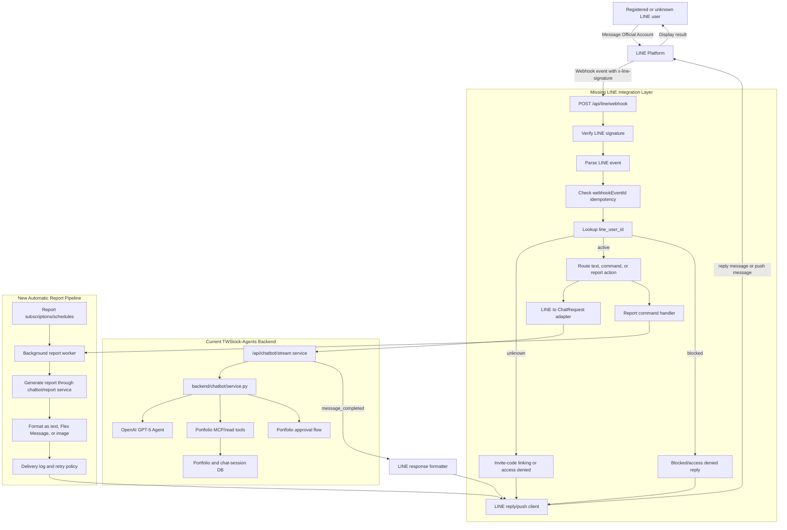

# LINE Chatbot And Automatic Report Delivery Design

Date: 2026-05-28
Status: Draft for user review

## Desired Outcome

Users should be able to interact with the TWStock-Agents backend from LINE, but only after they are registered or linked. The same LINE integration should later support automatic report delivery, so the backend can generate portfolio or stock reports and send them to approved users through LINE.

The first useful outcome is a private beta flow:

1. A user adds the LINE Official Account.
2. The user links their LINE identity with an invite code or an existing app account.
3. The user sends a stock or portfolio question in LINE.
4. The backend verifies the LINE request, confirms the LINE user is active, calls the existing chatbot/report logic, and replies in LINE.
5. Later, the backend can generate scheduled reports and push them to the same registered LINE user.

## Current Project Fit

The project already has the main backend pieces needed behind the LINE adapter:

- `backend/app.py` creates the FastAPI app and mounts the current API routers.
- `backend/api/chatbot.py` exposes `POST /api/chatbot/stream`.
- `backend/chatbot/service.py` builds the GPT-5 chatbot agent and streams NDJSON events.
- `backend/portfolio` stores portfolios, holdings, chat sessions, and persistence helpers.
- `backend/chatbot/approvals.py` supports human approval before applying portfolio mutations.
- `docs/API_EXAMPLES.md` documents the current chatbot and portfolio API shape.

The main mismatch is that the current chatbot API streams NDJSON to a web client. LINE webhooks are request/response events, and LINE messages are sent through reply or push APIs. A LINE integration should consume the backend stream internally, collect the final `message_completed` content, and send that final content to LINE.

## What Is Missing

The project does not yet have these pieces:

- LINE webhook endpoint, such as `POST /api/line/webhook`.
- LINE channel configuration: channel secret and channel access token.
- LINE request signature verification using the `x-line-signature` header.
- LINE event parser for text messages, postbacks, follow events, and delivery edge cases.
- LINE user registry that maps `line_user_id` to an app user, portfolio, and access status.
- Account linking flow, preferably invite-code based for the first private beta.
- LINE reply/push client for sending messages back to users.
- Adapter that converts LINE text events into the existing chatbot request format.
- Adapter that converts chatbot output into LINE text, Flex Messages, or report images.
- Background job or scheduler layer for automatic reports.
- Idempotency handling for webhook redelivery and push retries.
- Delivery logs for report sends, failures, and retries.
- Tests for webhook auth, user authorization, event parsing, chatbot adapter behavior, and push delivery.

## External LINE Capabilities To Use

LINE Messaging API supports:

- Webhooks for receiving user messages and account events.
- Reply messages for responding to a specific webhook event.
- Push messages for sending messages later to a known LINE user.
- Multicast or narrowcast style delivery for sending to multiple users, if needed later.
- Text messages, template messages, image messages, quick replies, and Flex Messages.
- Webhook signature verification with the channel secret.
- Retry/idempotency controls for delivery requests.

Useful official references:

- LINE Messaging API overview: https://developers.line.biz/en/docs/messaging-api/overview/
- Receiving messages: https://developers.line.biz/en/docs/messaging-api/receiving-messages/
- Sending messages: https://developers.line.biz/en/docs/messaging-api/sending-messages/
- Verify webhook signature: https://developers.line.biz/en/docs/messaging-api/verify-webhook-signature/
- Message types: https://developers.line.biz/en/docs/messaging-api/message-types/
- Quick replies: https://developers.line.biz/en/docs/messaging-api/using-quick-reply/

## User Stories

### Access And Registration

As an admin, I want to register who can use the LINE bot, so that private portfolio or report functionality is not available to unknown LINE users.

Acceptance criteria:

- Unknown LINE users cannot trigger chatbot or report generation.
- Unknown LINE users receive a short account-linking or access-denied message.
- Active LINE users can use the bot.
- Blocked LINE users cannot use the bot even if they were previously linked.

### Invite-Code Linking

As a user, I want to link my LINE account with an invite code, so that I can use the bot without needing a full web login flow.

Acceptance criteria:

- User can send a command such as `link ABC123`.
- Backend validates the invite code.
- Backend stores the LINE user ID and links it to an internal app user or portfolio.
- Used or expired invite codes cannot be reused.
- The user receives a clear success or failure message.

### Chat Through LINE

As a registered user, I want to ask questions in LINE, so that I can interact with the existing assistant without opening the web app.

Acceptance criteria:

- User sends a text message to the LINE Official Account.
- Backend verifies the webhook came from LINE.
- Backend checks the LINE user is active.
- Backend converts the text into the current chatbot message format.
- Backend calls the existing chatbot service.
- Backend sends the final assistant answer back to LINE.

### Portfolio-Aware Chat

As a registered user with a linked portfolio, I want the LINE bot to understand my selected portfolio, so that it can answer portfolio-specific questions.

Acceptance criteria:

- User account has a default portfolio or an explicit portfolio selection.
- Chatbot request includes the linked `portfolio_id`.
- Read-only portfolio tools can be used when helpful.
- Portfolio mutation proposals still require approval and are not silently applied.

### Automatic Reports

As a registered user, I want to receive scheduled reports in LINE, so that I can get portfolio or stock updates without manually asking.

Acceptance criteria:

- User can be subscribed to one or more report schedules.
- Backend generates reports in the background.
- Backend sends generated reports through LINE push messages.
- Failed sends are logged and retried according to a defined policy.
- User can be unsubscribed or blocked from future report delivery.

### Report Presentation

As a user, I want reports to be readable inside LINE, so that I can quickly understand the result on mobile.

Acceptance criteria:

- Version 1 can send plain text summaries.
- Later versions can use Flex Messages for structured cards.
- Large reports are split into multiple messages or linked to a generated artifact.
- The message includes enough context to understand the report without opening the web app.

## Recommended Approach

Start with an invite-code authenticated LINE adapter. This is the smallest path that proves the desired outcome without requiring full LINE Login, LIFF, billing, or a larger identity system.

The recommended build order is:

1. Add LINE configuration and webhook verification.
2. Add LINE user registry and invite-code linking.
3. Add text-message chatbot replies for active users.
4. Add report generation as an internal background job.
5. Add LINE push delivery for generated reports.
6. Upgrade report formatting from plain text to Flex Messages after the message content stabilizes.

## Alternatives Considered

### Option 1: Admin Pre-Registration Only

Admin manually adds allowed LINE user IDs to the database.

Pros:

- Very simple.
- Good for internal testing.
- Minimal user-facing flow.

Cons:

- Admin must discover and enter LINE user IDs.
- Poor fit for a beta with external users.
- Does not give users a natural onboarding path.

### Option 2: Invite-Code Linking

User sends a one-time code in LINE to link the account.

Pros:

- Simple enough for a private beta.
- Gives explicit access control.
- Does not require full LINE Login or LIFF setup.
- Works well with the existing backend.

Cons:

- Invite code management must be built.
- Users must type a linking command.
- Later consumer-scale onboarding may need a richer flow.

### Option 3: Full LINE Login Or LIFF Linking

User logs in through a LINE Login or LIFF-based flow.

Pros:

- Best long-term user experience.
- Stronger fit for a public product.
- Can integrate with an app account system.

Cons:

- More setup and frontend work.
- Requires a clearer user account model than the project currently has.
- Too large for the first proof of outcome.

Recommendation: choose Option 2 first.

## Full System Diagram

## Proposed Data Model Additions

### `line_users`

Stores LINE identities that are allowed or pending.

Fields:

- `id`
- `line_user_id`
- `app_user_id`
- `default_portfolio_id`
- `status`: `pending`, `active`, or `blocked`
- `created_at`
- `updated_at`
- `last_seen_at`

### `line_invite_codes`

Stores one-time or limited-use invite codes.

Fields:

- `id`
- `code_hash`
- `app_user_id`
- `default_portfolio_id`
- `status`: `active`, `used`, `expired`, or `revoked`
- `expires_at`
- `used_by_line_user_id`
- `used_at`
- `created_at`

### `line_webhook_events`

Stores processed webhook IDs for idempotency and audit.

Fields:

- `id`
- `webhook_event_id`
- `line_user_id`
- `event_type`
- `received_at`
- `processed_at`
- `status`

### `line_report_subscriptions`

Stores report delivery preferences.

Fields:

- `id`
- `line_user_id`
- `portfolio_id`
- `report_type`
- `schedule`
- `timezone`
- `status`: `active`, `paused`, or `cancelled`
- `created_at`
- `updated_at`

### `line_delivery_logs`

Stores reply and push delivery attempts.

Fields:

- `id`
- `line_user_id`
- `message_type`
- `request_key`
- `status`
- `error_message`
- `created_at`
- `sent_at`

## API And Module Additions

Suggested modules:

- `backend/api/line.py`: FastAPI router for LINE webhooks and admin/test endpoints.
- `backend/line/config.py`: LINE channel secret, access token, and feature flags.
- `backend/line/security.py`: signature verification.
- `backend/line/client.py`: reply, push, multicast, and loading-indicator calls.
- `backend/line/schemas.py`: internal event and message models.
- `backend/line/service.py`: event handling, user lookup, linking, and routing.
- `backend/line/reports.py`: report command handling and report delivery helpers.
- `backend/line/models.py`: SQLAlchemy tables for LINE users, invite codes, events, subscriptions, and delivery logs.

Suggested endpoints:

- `POST /api/line/webhook`: public LINE webhook endpoint.
- `POST /api/line/invite-codes`: admin endpoint to create invite codes.
- `GET /api/line/users`: admin endpoint to inspect linked users.
- `POST /api/line/users/{id}/block`: admin endpoint to revoke access.
- `POST /api/line/reports/test-send`: internal/admin endpoint to test a report send.

## Message Flow: Registered Chat

1. LINE sends a webhook to `POST /api/line/webhook`.
2. Backend verifies `x-line-signature`.
3. Backend parses the message event.
4. Backend checks whether `source.userId` maps to an active `line_users` row.
5. Backend converts the LINE text into a chatbot user message.
6. Backend calls the existing chatbot stream service.
7. Backend accumulates `text_delta` chunks and waits for `message_completed`.
8. Backend formats the final answer for LINE.
9. Backend sends a reply message using LINE's reply API.
10. Backend records the event and delivery result.

## Message Flow: Unknown User

1. LINE sends a webhook from an unknown `line_user_id`.
2. Backend verifies the request and checks the registry.
3. If the message starts with `link <code>`, backend validates the invite code.
4. If valid, backend activates the LINE user and sends a success reply.
5. If invalid or absent, backend sends a short linking instruction or access-denied reply.
6. Backend does not call the chatbot or report service.

## Message Flow: Automatic Report

1. Report scheduler selects active report subscriptions.
2. Background worker loads user, portfolio, and report preferences.
3. Worker generates report content through the report/chatbot service.
4. Formatter converts the report into LINE-compatible messages.
5. LINE client sends push messages to the linked `line_user_id`.
6. Delivery result is logged.
7. Failures are retried or marked failed according to policy.

## Security Requirements

- Always verify `x-line-signature` before parsing or processing webhook content.
- Never accept a claimed LINE user ID from the client; use only the webhook event source.
- Deny all chatbot/report requests unless `line_user.status == active`.
- Store LINE channel access token and channel secret in environment variables.
- Do not log access tokens or full webhook payloads if they include sensitive user content.
- Use one-time invite codes or hashed invite codes in storage.
- Use webhook idempotency to avoid duplicate processing during LINE redelivery.
- Keep portfolio mutation approval behavior; LINE chat should not bypass approval.

## Error Handling

- Invalid signature: return `403` and do not process the event.
- Duplicate webhook event: return success without repeating side effects.
- Unknown user: reply with linking instructions or deny access.
- Blocked user: reply with access denied or stay silent, depending on product preference.
- Chatbot failure: reply with a short failure message and log details server-side.
- LINE delivery failure: record failed delivery and retry only when safe.
- Long report generation: acknowledge the webhook quickly and send result later by push.

## Testing Plan

Unit tests:

- Signature verification accepts valid signatures and rejects invalid signatures.
- Invite-code linking handles valid, invalid, expired, and reused codes.
- Unknown, active, and blocked LINE users are routed correctly.
- LINE text messages are converted into chatbot requests correctly.
- Chatbot stream output is accumulated into a final LINE reply.
- Duplicate webhook event IDs do not trigger duplicate replies or report jobs.

Integration tests:

- `POST /api/line/webhook` rejects invalid signatures.
- `POST /api/line/webhook` links a user with a valid invite code.
- `POST /api/line/webhook` calls the chatbot for active users.
- Report worker sends a push message and writes a delivery log.

Manual testing:

- Use LINE Developers webhook test tools or a tunnel such as ngrok for local testing.
- Add the Official Account from a test LINE account.
- Test unknown-user denial, invite linking, normal chat, and one report push.

## Phased Delivery Plan

### Phase 1: Private LINE Chat Beta

Scope:

- LINE webhook endpoint.
- Signature verification.
- Text message handling.
- Invite-code linking.
- Active-user authorization.
- Plain text chatbot replies.

Outcome:

- Registered users can ask the assistant questions through LINE.
- Unknown users cannot use the assistant.

### Phase 2: Portfolio Context

Scope:

- Link LINE user to a default portfolio.
- Include `portfolio_id` in chatbot requests.
- Preserve approval flow for portfolio mutations.

Outcome:

- Registered users can ask portfolio-aware questions in LINE.

### Phase 3: Automatic Reports

Scope:

- Report subscriptions.
- Background report generation.
- LINE push delivery.
- Delivery logs and retry policy.

Outcome:

- Registered users can receive scheduled reports in LINE.

### Phase 4: Better LINE UX

Scope:

- Flex Message report cards.
- Quick replies for common actions.
- Report links or generated images for longer content.
- Optional LIFF or LINE Login account linking.

Outcome:

- The LINE experience becomes easier to use and more polished on mobile.

## Open Product Decisions

These decisions should be confirmed before implementation:

- Should unknown users receive linking instructions or a silent deny?
- Who creates invite codes: admin-only API, CLI script, or web UI?
- Does every LINE user map to one default portfolio at first?
- Which report should ship first: daily portfolio summary, stock watchlist, or weekly strategy report?
- Should report delivery times use Taiwan time by default?
- Should blocked users receive a message or no response?

## Definition Of Done For The Desired Outcome

The outcome is reached when:

- A LINE Official Account can call the backend webhook.
- Backend verifies LINE signatures.
- Only active registered LINE users can use the bot.
- Unknown or blocked users cannot trigger chatbot/report work.
- Active users can send a message and receive a chatbot response in LINE.
- Active users can receive at least one generated report by LINE push message.
- The system records enough event and delivery logs to debug failures.
- Tests cover signature verification, authorization, linking, chat routing, and report delivery.

