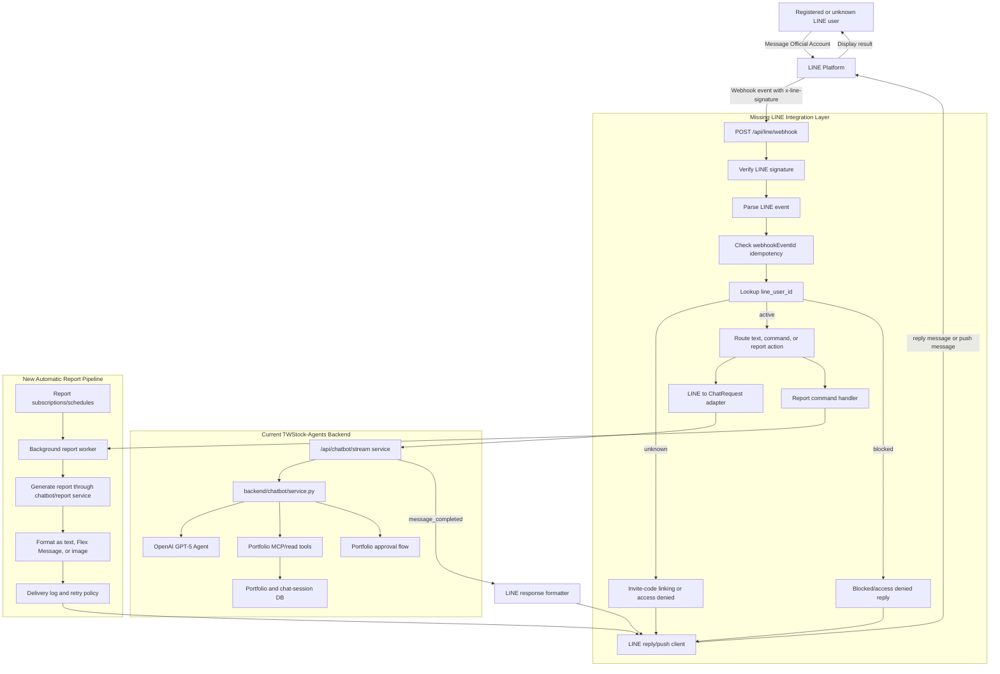

# 03. System Architecture

## Full System Diagram

## Registered Chat Flow

1. LINE sends a webhook to `POST /api/line/webhook`.
2. Backend verifies `x-line-signature`.
3. Backend parses the message event.
4. Backend checks whether `source.userId` maps to an active `line_users` row.
5. Backend converts the LINE text into a chatbot user message.
6. Backend calls the existing chatbot stream service.
7. Backend accumulates `text_delta` chunks and waits for `message_completed`.
8. Backend formats the final answer for LINE.
9. Backend sends a reply message using LINE's reply API.
10. Backend records the event and delivery result.

## Unknown User Flow

1. LINE sends a webhook from an unknown `line_user_id`.
2. Backend verifies the request and checks the registry.
3. If the message starts with `link <code>`, backend validates the invite code.
4. If valid, backend activates the LINE user and sends a success reply.
5. If invalid or absent, backend sends a short linking instruction or access-denied reply.
6. Backend does not call the chatbot or report service.

## Automatic Report Flow

1. Report scheduler selects active report subscriptions.
2. Background worker loads user, portfolio, and report preferences.
3. Worker generates report content through the report/chatbot service.
4. Formatter converts the report into LINE-compatible messages.
5. LINE client sends push messages to the linked `line_user_id`.
6. Delivery result is logged.
7. Failures are retried or marked failed according to policy.

