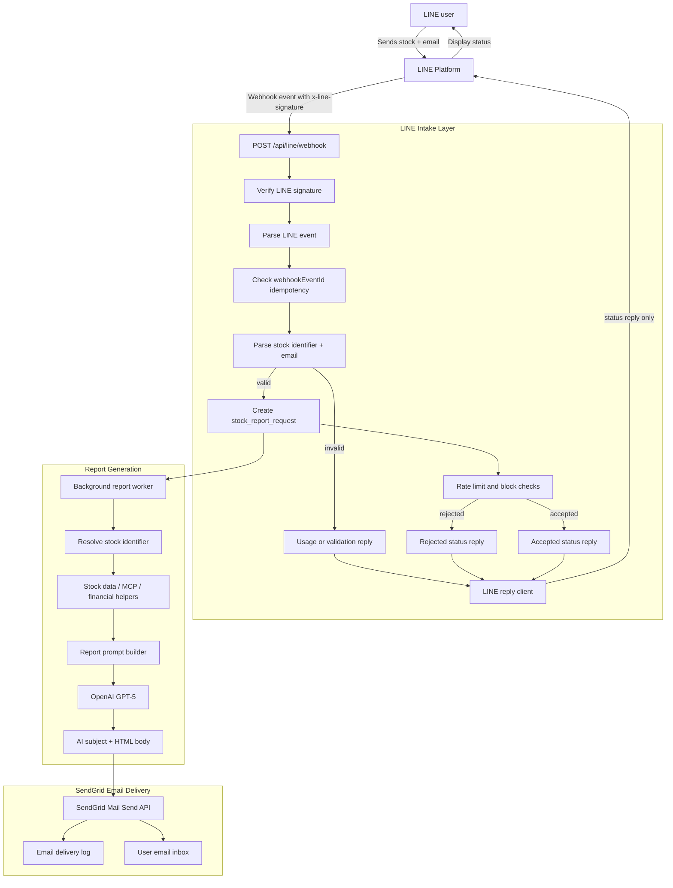

# 03. System Architecture

## Full System Diagram

## V1 Request Flow

1. LINE sends a webhook to `POST /api/line/webhook`.
2. Backend verifies `x-line-signature`.
3. Backend parses the message event.
4. Backend checks idempotency with `webhookEventId`.
5. Backend parses only stock name or stock number plus email.
6. Invalid messages receive a LINE usage reply.
7. Valid messages create a report request.
8. Backend applies block and rate-limit checks.
9. Backend replies in LINE with accepted or rejected status.
10. Background worker generates the report and sends it through SendGrid.

## Email Report Flow

1. Report worker picks up an accepted report request.
2. Worker resolves the stock identifier.
3. Worker gathers required stock context.
4. AI generates an email subject and HTML body.
5. Backend sends the email through SendGrid.
6. Backend stores delivery status and SendGrid response details.
7. If delivery fails safely, backend retries according to policy.

